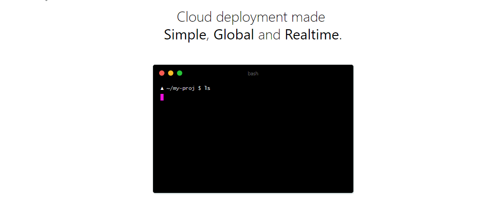

Deployment is a pain in the butt for small testing projects to setup a cloud VM in AWS or DigitalOcean. But recently I found this awesome deployment service from zeit, the creator of next js framework for which I will write a post later. It is called now. It is really a single command login. They also provide unlimited deployment, yeah really unlimited deployment. They also provide free global DNS. But code go open source in free plan though and you have 1 GB of bandwidth every month. But it is the most awesome free plan that I can find in the entire deployment services. It supports node js, static site and docker deployment.Lets see how it works. _GIF taken from ZEIT site._

---

---

Saw its magic. Only one `now` command. It gives you a unique url every single time. Great thing is that your previous deployments does not omit. ZEIT call it immutable deployment.

---

### Head [here](http://zeit.co/now) to know more and check it out.
