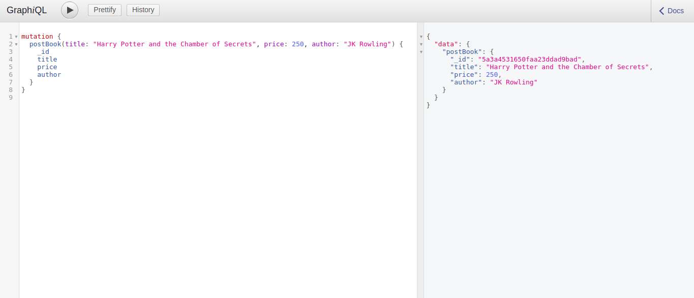
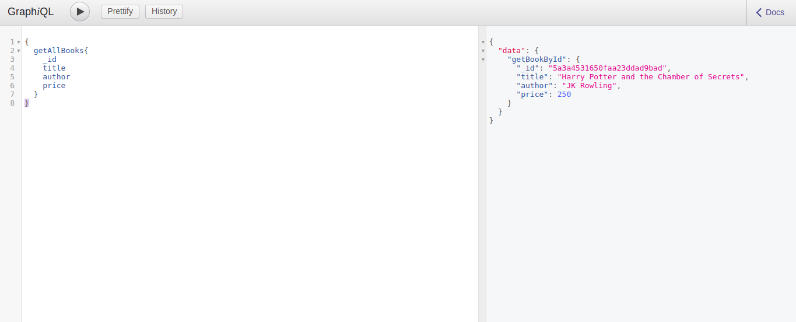
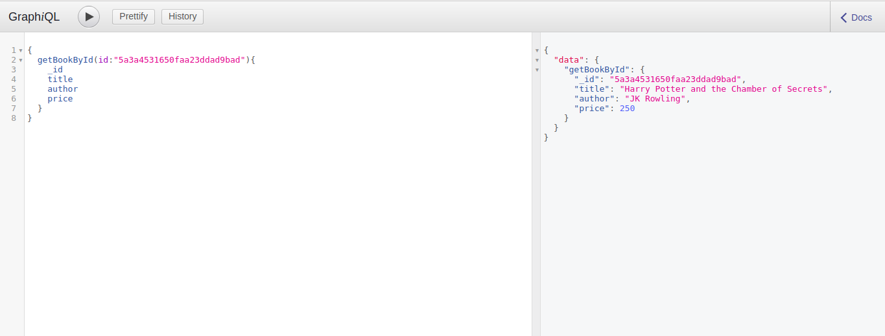

GraphQL bubble is up! It is growing very fast. Even I am using it in almost all of my projects and I am loving the design pattern. In this post I am going to show you how you can make a graphql API using express(popular nodejs web framework) and will be using popular Apollo graphql tools to make the thing happen.

Repo for this if someone wanna clone this directly: https://github.com/pantharshit00/grapqhql-api

---

## What TF is graphql?

Graphql is sort of SQL like replacement for RESTful APIs. In graphql you make queries instead of endpoints and ask your server to provide only the parts of the data you want. There is only one endpoint exposed in graphql that handles all sort of things. _Official definition([from docs](http://graphql.org))_:-GraphQL is a query language for APIs and a runtime for fulfilling those queries with your existing data. In graphql you define you data structure in a schema sort of like you define tables in a SQL database which you can manipulate using the operations provided the graphql.

There are mainly three types of operations in graphql. Instead of a GET request you make a `query`. In place of POST, PUT or DELETE request you make a `mutation`. As name suggests a mutation in graphql is the operation which modifies the data on the server. The third type is called `subscriptions` which is used to make real time connection through sockets. It uses a pubsub mechanism. These three are also called root schema types.

While building an API for handling a Bookstore in that first we define the schema using different types and then resolve the types by fetching the data from a source like a database(MongoDB or postgres maybe). You may even use a existing RESTFul API as a source and wrap it in a graphql API.

---

## Prerequisites for the tutorial

As usual you will need:

1. Node js (I recommend getting version 8 LTS but dont use less then 7.6)
2. MongoDB (Although you can use any other DB just use you resolution logic)
3. I recommend having yarn installed
4. A Good browser (Now we have choices (🔥) 😉 )
5. I also recommend a graphql plugin for you text editor. VSCode has great one. Get it [here](https://marketplace.visualstudio.com/items?itemName=kumar-harsh.graphql-for-vscode)

---

## Install Dependencies

As expected we will start by bloating our holy `node_modules` folder with dependencies.

```bash
$ yarn init -y # or npm init -y
$ yarn add express graphql graphql-tools apollo-server-express mongoose # or
$ npm i express graphql graphql-tools apollo-server-express mongoose --save # for npm users
```

---

## Setting up express & mongoose boilerplate

Create file `app.js` in root of your project directory. This is simple express & mongoose boilerplate you might wanna copy paste this.

```javascript
const express = require('express');
const mongoose = require('mongoose');

mongoose.Promise = global.Promise;

mongoose.connect(process.env.DB || 'mongodb://localhost:27017/bookstore', {
  useMongoClient: true,
});

mongoose.connection.on('connected', () => console.log('Connected to mongo'));
mongoose.connection.on('error', e => console.log(`Aw shoot mongo --> ${e}`));

const BookSchema = new mongoose.Schema({
  title: String,
  author: String,
  price: Number,
});

mongoose.model('Book', BookSchema);

const app = express();

const PORT = process.env.PORT || 8080;

app.listen(PORT, () => {
  console.log(`UP on --> http://localhost:${PORT}`);
});
```

Start you server by `node app.js`. On pointing your browser to http://localhost:8080 you should get `Cannot get /` as we have not defined any routes. You should install nodemon for live server reloading.

---

## Defining our Schema

Our schema in apollo based client is essentially a giant string. We will defining the structure of our bookstore data.

Create a file named `schema.js` and the following.

```javascript
module.exports = `
  type Query{
    getAllBooks: [Book]
    getBookById(id: String!): Book
  }
  type Mutation{
    postBook(title:String! author:String! price: Int!): Book!
    deleteBook(id:String!): Book
    updateBook(title:String! author:String! price: Int! id:String!): Book!
  }
  type Book{
    _id: String!
    title: String!
    author: String!
    price: Int!
  }
`;
```

Looks familiar ha like JSON. There are two root type that I explained above. They are query and mutation. We define a query name in the key and what we want to return the value. You may be wondering how I used Book in there. Well we can group some properties to make a custom type. It consist of primitive type like String, Int , Bool, Float etc. The `!` denotes that the property can't be null be resolved otherwise it will throw an error. It will make more sense when we will resolve the fields.

---

## Resolving our fields

Now once we have defined structure of our data in the schema now we have to resolve that in some ways. In this example we are going to use mongoose to grab the data. The resolver takes three argument in the function. The first argument is called parent which defines the old resolved value of the field. It is useful if we want to manipulate the data after fetching it from the db. But it will not be required in this example. Second argument is called argument or values which are the values passed to the queries when it is called. See the `getBooksById` query above. The argument is the id defined the parenthesis. The third argument is called context. It is passed when we create our endpoint and can hold values like req.user, secrets etc.

So now create a `resolver.js` and add the following

```js
const mongoose = require('mongoose');

const Book = mongoose.model('Book');

module.exports = {
  Query: {
    getAllBooks: async () => await Book.find(),
    getBookById: async (parent, args) => await Book.findById(args.id),
  },
  Mutation: {
    postBook: async (parent, args) => {
      const newBook = new Book(args);
      return await newBook.save();
    },
    deleteBook: async (parent, { id }) => {
      // You can destructure the args
      return await Book.findByIdAndRemove(id);
    },
    updateBook: async (parent, { id: _id, ...doc }) => {
      await Book.update({ _id }, doc);
      return { _id, ...doc };
    },
  },
};
```

As seen in the code resolver is giant object having Query and Mutations as the root key. Each query and mutation is defined in our schema earlier. They are essentially a function which return the data at last.

---

## Making the graphql endpoint

Add this code to make a graphql endpoint. It is simple express middleware stuff. We are also going to add graphiql which is a graphql client to test API sort of postman if you are familiar with that.

```diff
const express = require('express');
const mongoose = require('mongoose');
+ const { makeExecutableSchema } = require('graphql-tools');
+ const { graphiqlExpress, graphqlExpress } = require('apollo-server-express');

mongoose.Promise = global.Promise;

mongoose.connect(process.env.DB || 'mongodb://localhost:27017/bookstore', {
  useMongoClient: true,
});

mongoose.connection.on('connected', () => console.log('Connected to mongo'));
mongoose.connection.on('error', (e) => console.log(`Aw shoot mongo --> ${e}`));

const BookSchema = new mongoose.Schema({
  title: String,
  author: String,
  price: Number
});

mongoose.model('Book', BookSchema);

+ const typeDefs = require('./schema');
+ const resolvers = require('./resolver');

const app = express();

const PORT = process.env.PORT || 8080;


+ const schema = makeExecutableSchema({
+  typeDefs,
+  resolvers
+ });

+ app.use(
+  '/graphql',
+  express.json(),
+  graphqlExpress(() => ({
+    schema,
+  })),
+ );

+ app.use(
+  '/graphiql',
+  graphiqlExpress({
+    endpointURL: '/graphql',
+  }),
+ );

app.listen(PORT, () => {
  console.log(`UP on --> http://localhost:${PORT}`);
});
```

---

## Test it using graphiql

Go to http://localhost:8080/graphiql to open it here are few screenshots







Task for you is to write update and delete mutation. Get to Work!

---

## Conclusion

Graphql is a amazing technology. See how easy is to implement a CRUD API. You should definitely use it your stack.

---

## Next Steps

Now we need a client side app to utilize this API. Apollo client is great one. I will surely write a blog implementing this in apollo client. I will post the link here once it is done.
